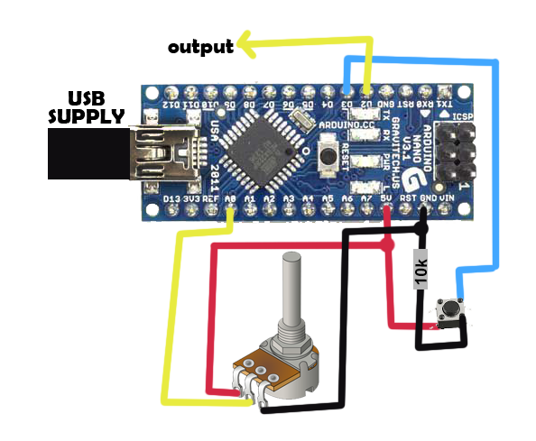

# weldertimer

## Purpose
Control the ON time of pulse with a potentiometer and fire up with a button.
Send a time critical pulse to any machine. F.E. TIG welder etc... This project transforms a random duration input pulse from a button, to a standard duration pulse. The output pulse duration is controlled by a potentiometer. The button press causes a single pulse in the output and the output pulse starts immediately on the button press (positive edge trigger). 

## Hardware:
Material:
- 1 potentiometer
- 1 button
- 1 10K Resistor
- 1 USB power supplier
- 1 Arduino board (Nano / Uno or any other)

Circuit:
- Arduino Board to power supply
- Potentiometer pins to {VCC, potentiometer (Analog pin), GND}
- Button to isON digital pin (normally low)
- Machine to control attached to pulsePin digital pin (maybe through a resistor)

